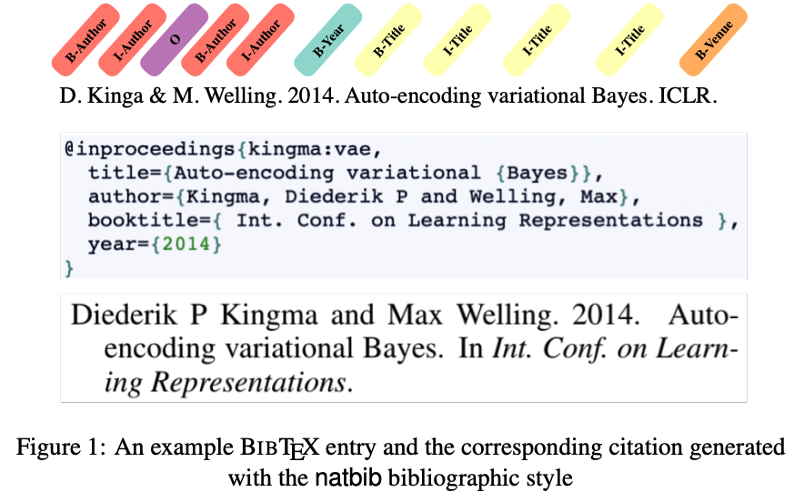

# Bibtex-Fields-Extraction
This repository is for the following paper
[Dung Thai<sup>*</sup>](https://people.cs.umass.edu/~dthai/), Zhiyang Xu, [Nicholas Monath<sup>*</sup>](https://people.cs.umass.edu/~nmonath/), [Boris Veytsman<sup>*</sup>](http://borisv.lk.net), and [Andrew McCallum<sup>*</sup>](https://people.cs.umass.edu/~mccallum/), "Using BIBTEX to Automatically Generate Labeled Data for Citation Field Extraction" [[OpenReview]](https://openreview.net/pdf?id=OnUd3hf3o3)


## Introduction
Accurate parsing of citation reference strings is crucial to automatically construct scholarlydatabases such as Google Scholar or Semantic Scholar. Citation field extraction (CFE) is precisely this task—given a reference label which tokens refer to the authors, venue, title, editor, journal, pages, etc. Most methods for CFE are supervised and rely on training from labeled datasets that arequite small compared to the great variety of reference formats. BIBTEX, the widely used reference management tool, provides a natural method to automatically generate and label training data for CFE. In this paper, we describe a technique for using BIBTEX to generate, automatically, a large-scale (41M labeled strings), labeled dataset, that is four orders of magnitude larger than the current largest CFE dataset, namely the UMass Citation Field Extraction dataset  [Anzaroot and McCallum, 2013]. We experimentally demonstrate how our dataset can be used to improve the performance of the UMass CFE using a RoBERTa-based [Liu et al., 2019] model. In comparison to previous SoTA, we achieve a 24.48% relative error reduction, achieving span level F1-scores of 96.3%.


## Prepare labeled citation strings 
1. Go to data_script directory
```
cd data_script
```
2. Install requirments
```
pip install requirements.txt
```
3. Generate labeled citation strings in CONLL format. (To assure the quality, there should be only one citation in your BibTex file. You can pick up one style from the provided bst)
```
python prepro_bibtex.py <your_bibfile_path> <style>
```
## Pretrain a RoBERTa language model using generated citation strings
1. Requirements and Installation
* [PyTorch](http://pytorch.org/) version >= 1.4.0
* Python version >= 3.6
* For training new models, you'll also need an NVIDIA GPU and [NCCL](https://github.com/NVIDIA/nccl)
* **To install fairseq** and develop locally:
```bash
git clone https://github.com/pytorch/fairseq
cd fairseq
pip install --editable ./
```
* **To install huggingface** and develop locally:
```
git clone https://github.com/huggingface/transformers
cd transformers
pip install .
```
2. Preprocess/binarize the BibTex-5M data. Download the corpus of BibTex-5M and put it in data-raw direcory.
```
./preprocess.sh
```
3. Train a language model. 
```
./pretrain.sh
```
4. Convert fairseq roberta checkpoint to pytorch
```
python convert_checkpoint.py --roberta_checkpoint_path models/roberta.bibtex/checkpoint_last.pt --pytorch_dump_folder_path huggingface/roberta.5M
```
## Train a RoBERTa NER model using labeled citation strings
1. Train a RoberTa BibTex NER model
```
./bibtex_ner.sh
```
2. Fine-tune BibTex NER model on UMass CFE dataset
```
./umass_ner.sh
```
## Evaluate the performance on UMass CFE dataset
1. Generate prediction
```
./eval.sh
```
2. Compute recall, precision and F1 score 
```
python eval_script/evaluation.py huggingface/roberta.5M.bibtex.umass/test_predictions.txt data-raw/bibtex-ner-umass/test.txt huggingface/roberta.5M.bibtex.umass/eval.txt
./eval_script/run_eval.sh huggingface/roberta.5M.bibtex.umass/eval.txt
```
## Summary of the Bibtex 41M dataset
 
## Citation
If you find the code helpful in your resarch or work, please cite the following paper.
```
@inproceedings{
thai2020using,
title={Using BibTeX to Automatically Generate Labeled Data for Citation Field Extraction},
author={Dung Thai and Zhiyang Xu and Nicholas Monath and Boris Veytsman and Andrew McCallum},
booktitle={Automated Knowledge Base Construction},
year={2020},
url={https://openreview.net/forum?id=OnUd3hf3o3}
}
```
